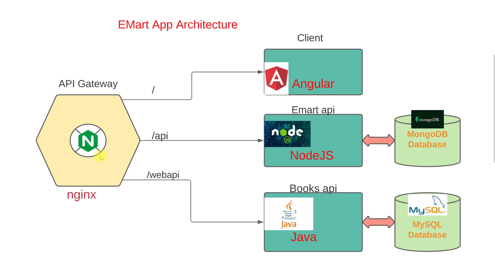

# 🛒 Emart Microservices Project (DevOps Practice)

This project is a hands-on implementation of a microservices-based e-commerce application using Docker and Vagrant. It was built to learn and practice the fundamentals of containerization, networking, orchestration, and troubleshooting in a production-like environment.

---

## 🖼️ Architecture Diagram

The architecture follows a microservices model with separate containers for:
- Frontend (Nginx)
- Backend application (Java/Tomcat)
- Database (MySQL)
- Cache (Memcached)
- Messaging Queue (RabbitMQ)

---

## 📌 Project Objectives

- Understand microservices architecture
- Learn Docker and Docker Compose
- Simulate deployment in a Vagrant-managed VM
- Handle container orchestration and networking
- Practice real-world troubleshooting

---

## ⚙️ Tech Stack

| Component        | Technology              |
|------------------|--------------------------|
| Frontend         | Nginx                   |
| Application      | Java/Tomcat (Spring Boot) |
| Database         | MySQL                   |
| Cache            | Memcached               |
| Messaging Queue  | RabbitMQ                |
| Containerization | Docker                  |
| Orchestration    | Docker Compose          |
| VM Provisioning  | Vagrant                 |

---
